# Diagrams

Diagrams are written in Mermaid (`diagrams/*.mmd`) and **pre-rendered to SVG**
so both GitHub and the in-app docs show them without a runtime renderer.
Re-render after editing a source file:

```bash
cd docs/architecture/diagrams
npx -y @mermaid-js/mermaid-cli@11 -i architecture.mmd -o architecture.svg -b white
npx -y @mermaid-js/mermaid-cli@11 -i request-flow.mmd -o request-flow.svg -b white
```

## Architecture and trust boundaries

In plain language: your browser talks to one web app in Azure. That app is the
only thing allowed to reach the AI model, and it reaches it over a private
network connection using its own Azure identity, not a password.



Trust boundaries:

1. **Browser → Container Apps (public HTTPS).** Untrusted input. Bounded,
   rate-limited, schema-validated. Persona roles are looked up server-side.
2. **Container Apps → Foundry (private endpoint).** Entra ID token from the
   user-assigned managed identity. Foundry has public access and API keys off.
3. **Model output → tools.** The model only proposes a tool call; it is
   validated (account ID format, amount bounds) and then judged by ACS.
4. **Tool output → browser.** Projected to an allow-list of fields and length
   before streaming.

## Request flow


