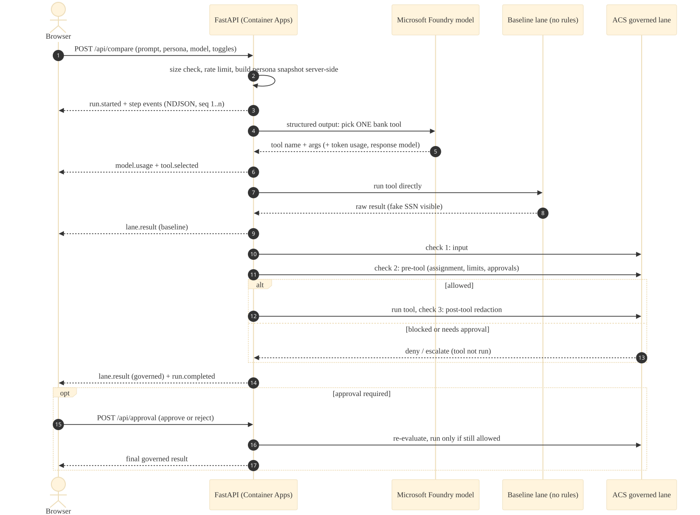

# Diagrams

Diagrams are written in Mermaid (`diagrams/*.mmd`) and **pre-rendered to SVG**
so GitHub and the in-app docs show them without a runtime renderer. Re-render
after editing a source file (`make diagrams` does the same):

```bash
cd docs/architecture/diagrams
for d in architecture identity acs-flow request-flow; do
  npx -y @mermaid-js/mermaid-cli@11 -i "$d.mmd" -o "$d.svg" \
    -p puppeteer.json -C render.css -b white
done
```

## 1. Architecture: four layers

In plain language: your browser talks to **one** web app in Azure. Inside that
app, the AI model only *suggests* an action, and the **ACS policy engine**
decides whether it may run. The app reaches the AI model over a **private**
network connection using its own Azure identity, not a password. Everything
reports to one monitoring workspace.


| Layer | Trust boundary | What protects it |
|---|---|---|
| ① → ② | Public internet → app | HTTPS only; size, schema, and rate limits; persona roles looked up on the server |
| Inside ② | Model suggestion → tool | Tool name and arguments validated, then judged by ACS before running |
| ② → ③ | App → AI model | Private endpoint; Entra ID token from the managed identity; Foundry keys and public access off |
| ② → ① | Tool result → browser | ACS redaction, then an allow-list of fields and a length cap |

## 2. Identity and access: who can do what

Every arrow is one Azure role assignment. The app has exactly three
permissions, each on exactly one resource. There are no keys or passwords. A
developer can optionally get the same two data permissions for local testing
(dotted lines); both grants come from the same Bicep module, so they can't drift apart.



## 3. How ACS decides (governance flow)

The three ACS checks, human approval, and where a request can be blocked. The
[governance code tour](../governance-tour.md) walks through the code behind each box.


## 4. One request, step by step


