# Governance code tour: Agent Governance Toolkit and ACS

## In plain language

An AI assistant that can take actions needs a referee. In this demo the referee
is **ACS**, the *Agent Control Specification* runtime from Microsoft's
open-source [Agent Governance Toolkit](https://github.com/microsoft/agent-governance-toolkit).

ACS checks the assistant at three moments, called **intervention points**:

1. **input**: when a request arrives (is the request itself safe?)
2. **pre_tool_call**: before a tool runs (is *this exact* action allowed?)
3. **post_tool_call**: after a tool runs (does the result leak private data?)

At each point, written rules give one of four answers:

| Answer | What happens | Example in this demo |
|---|---|---|
| `allow` | Continue. | Riley reads her own account A-1001. |
| `deny` | Stop. The tool never runs, and the rule is named. | Riley tries to read A-2001: `account_access_denied`. |
| `escalate` | Pause until a person approves or rejects. | A $12,000 transfer: `high_value_transfer_requires_approval`. |
| `transform` | Let it through, but change the result. | An SSN in a result becomes `[SSN-REDACTED]`. |

The rules are written in **Rego**, a small language made for rules, and run by
[Open Policy Agent (OPA)](https://www.openpolicyagent.org/). The important idea
is that **the AI model never decides what is allowed**. It only suggests one
tool call. The rules decide, every time, in the same way.



> **Honest note about order.** In a normal agent you would run check ① before
> calling the model at all. This demo calls the model **once** and then runs
> the *same* tool call through both lanes (no rules vs. governed), so the model
> sees the prompt before check ① runs. The governed lane still blocks unsafe
> requests before any tool runs.

Each stop below shows current source code. The excerpts are pulled from the
real files when the docs are built, and the build fails if the code moves, so
this tour cannot drift out of date. See also the general [code tour](code-tour.md).

---

## Stop 1: getting ACS into the app

**What happens:** ACS has a fast core written in Rust. It isn't published as a
normal Python package, so the container build compiles it from a **pinned
commit** of the Agent Governance Toolkit. It also downloads OPA and checks it
against a known fingerprint (SHA-256). **Why it matters:** you always know
exactly which governance code is running, and nobody can quietly swap it.

<!-- tour:snippet id="dockerfile-acs-build" file="Dockerfile" lang="dockerfile" -->
<details open>
<summary><a href="https://github.com/michaelsrichter/bank-manager-standalone/blob/main/Dockerfile#L6-L30"><code>Dockerfile</code></a> · lines 6–30</summary>

```dockerfile
FROM python:3.12-slim AS acs-build
ARG AGT_COMMIT=c07577d9785d4f64225a7b367cb2a978e9fc784d
WORKDIR /build
RUN apt-get update \
    && apt-get install -y --no-install-recommends build-essential curl git pkg-config ca-certificates \
    && rm -rf /var/lib/apt/lists/* \
    && curl --proto '=https' --tlsv1.2 -sSf https://sh.rustup.rs | sh -s -- -y --profile minimal
ENV PATH="/root/.cargo/bin:${PATH}"
RUN git clone --filter=blob:none https://github.com/microsoft/agent-governance-toolkit.git agt \
    && git -C agt checkout "${AGT_COMMIT}" \
    && git -C agt rev-parse HEAD | grep -Fx "${AGT_COMMIT}" \
    && python -m pip wheel --no-cache-dir --no-deps --wheel-dir /wheels ./agt/policy-engine/sdk/python

FROM debian:bookworm-slim AS opa-build
ARG OPA_VERSION=v1.21.0
ARG OPA_SHA256=5eef70644868bb04d0556bcc795ee42f2ab379e73f51d1bfa30f83e1305bc9b9
WORKDIR /build
RUN apt-get update \
    && apt-get install -y --no-install-recommends ca-certificates curl \
    && rm -rf /var/lib/apt/lists/* \
    && curl --fail --location --proto '=https' --tlsv1.2 \
      "https://github.com/open-policy-agent/opa/releases/download/${OPA_VERSION}/opa_linux_amd64_static" \
      --output opa \
    && echo "${OPA_SHA256}  opa" | sha256sum --check \
    && chmod 0755 opa
```

</details>
<!-- tour:end -->

## Stop 2: the manifest, where the checks happen

**What happens:** the manifest is ACS's map. For each intervention point it says
*what* to look at (`policy_target`), which extra signals to gather
(`annotations`), and which Rego rule gives the answer (`query`).
**Why it matters:** the list of checkpoints is configuration you can read and
review. It isn't hidden inside application code.

<!-- tour:snippet id="manifest-intervention-points" file="backend/governance/manifest.yaml" lang="yaml" -->
<details open>
<summary><a href="https://github.com/michaelsrichter/bank-manager-standalone/blob/main/backend/governance/manifest.yaml#L6-L38"><code>backend/governance/manifest.yaml</code></a> · lines 6–38</summary>

```yaml
policies:
  bank_manager:
    type: rego
    bundle: ./policy
    query: data.agent_control_specification.bank_manager.verdict
intervention_points:
  input:
    policy_target: "$.input"
    policy_target_kind: user_input
    annotations:
      input_security:
        from: "$.input.text"
    policy:
      id: bank_manager
      query: data.agent_control_specification.bank_manager.input_verdict
  pre_tool_call:
    policy_target: "$.tool_call.args"
    policy_target_kind: tool_args
    tool_name_from: "$.tool_call.name"
    annotations:
      tool_adherence:
        from: "$.tool_call"
      fraud_classifier:
        from: "$.tool_call"
    policy:
      id: bank_manager
      query: data.agent_control_specification.bank_manager.pre_tool_call_verdict
  post_tool_call:
    policy_target: "$.tool_result"
    policy_target_kind: tool_result
    policy:
      id: bank_manager
      query: data.agent_control_specification.bank_manager.post_tool_call_verdict
```

</details>
<!-- tour:end -->

## Stop 3: loading the engine

**What happens:** the app builds one `AgentControl` from the manifest. Two
extras are plugged in:

- **Annotators.** The manifest asks for an LLM "security judge" and a fraud
  classifier. This demo uses simple, predictable keyword stand-ins so every run
  is free and repeatable. That is a documented gap, not a claim.
- **Telemetry sinks.** ACS reports every decision as OpenTelemetry metrics
  (`acs_intervention_*`) and as events on the current trace, without ever
  including prompt text or tool data.

<!-- tour:snippet id="governance-build-control" file="backend/bank_manager/bank/governance.py" lang="python" -->
<details open>
<summary><a href="https://github.com/michaelsrichter/bank-manager-standalone/blob/main/backend/bank_manager/bank/governance.py#L31-L57"><code>backend/bank_manager/bank/governance.py</code></a> · lines 31–57</summary>

```python
class HostAnnotators:
    """Deterministic stand-ins for the manifest's LLM/classifier annotators."""

    def dispatch(
        self,
        annotator_name: str,
        _config: Mapping[str, Any],
        preliminary_policy_input: Mapping[str, Any],
    ) -> Any:
        target = preliminary_policy_input["policy_target"]["value"]
        text = json.dumps(target, sort_keys=True).lower()
        if annotator_name == "input_security":
            return {"flagged": "social-engineer" in text or "jailbreak" in text}
        if annotator_name == "tool_adherence":
            return {"flagged": "override_limits" in text}
        if annotator_name == "fraud_classifier":
            return {"label": "fraud" if "mule" in text else "clear"}
        return {}


def build_control(manifest: Path = MANIFEST) -> AgentControl:
    return AgentControl.from_path(
        str(manifest),
        annotator_dispatcher=HostAnnotators(),
        # acs_intervention_* OTel metrics + decision events on the active span.
        telemetry_sink=[OtelMetricsTelemetrySink(), SpanEventTelemetrySink()],
    )
```

</details>
<!-- tour:end -->

## Stop 4: the snapshot, facts the rules can trust

**What happens:** rules need facts, such as who the manager is, which accounts
they may touch, and whether restricted mode is on. The server builds this
**snapshot** from its own list of personas. The browser only sends a persona ID.
**Why it matters:** a visitor can't type "I'm an admin" and get admin rights.

<!-- tour:snippet id="governance-snapshot" file="backend/bank_manager/bank/governance.py" lang="python" -->
<details open>
<summary><a href="https://github.com/michaelsrichter/bank-manager-standalone/blob/main/backend/bank_manager/bank/governance.py#L64-L83"><code>backend/bank_manager/bank/governance.py</code></a> · lines 64–83</summary>

```python
def manager_snapshot(
    persona_id: str,
    *,
    restricted_mode: bool,
    customer_approved: bool,
    admin_mode: bool,
) -> dict[str, Any]:
    """Build the policy snapshot server-side so the browser cannot forge roles."""
    persona = PERSONAS.get(persona_id)
    if persona is None:
        raise UnknownPersonaError(f"Unknown persona: {persona_id!r}")
    return {
        "manager_id": persona["manager_id"],
        "manager_role": persona["manager_role"],
        "assigned_account_ids": list(persona["assigned_account_ids"]),
        "mode": "restricted" if restricted_mode else "normal",
        "transfer_approved": customer_approved,
        "customer_ack_token": "chat-confirmed" if customer_approved else "",
        "admin_mode_active": admin_mode,
    }
```

</details>
<!-- tour:end -->

## Stop 5: check ①, input

**What happens:** before any tool runs, the request text is checked for
account-takeover phrases ("bypass approval"), SSN- or card-shaped numbers, and
the security annotator's flag. **Try it:** in the live demo, click *"Use
unauthorized transfer and bypass approval"*. The governed lane stops here with
`input_regex_fraud_or_pii`.

<!-- tour:snippet id="rego-input" file="backend/governance/policy/bank_manager.rego" lang="rego" -->
<details open>
<summary><a href="https://github.com/michaelsrichter/bank-manager-standalone/blob/main/backend/governance/policy/bank_manager.rego#L31-L37"><code>backend/governance/policy/bank_manager.rego</code></a> · lines 31–37</summary>

```rego
input_verdict := deny("input_regex_fraud_or_pii", "Input contains account takeover language, PII, or payment manipulation instructions.") if {
	input.intervention_point == "input"
	regex.match(`(?i)(unauthorized\s+transfer|bypass\s+(approval|limits?)|steal\s+funds|\b\d{3}-\d{2}-\d{4}\b|\b\d{4}[- ]?\d{4}[- ]?\d{4}[- ]?\d{4}\b)`, input_text)
} else := deny("input_llm_security_judge", "Input security annotator flagged the request.") if {
	input.intervention_point == "input"
	ann_flag("input_security")
}
```

</details>
<!-- tour:end -->

## Stop 6: check ②, pre_tool_call (the rule chain)

**What happens:** this is the heart of the policy. Rules are an ordered
`else` chain, and **the first rule that matches wins**. So "restricted mode"
beats everything, "not your account" beats "needs approval", and a hard
$50,000 limit can never be approved away. The excerpt stops at the high-value
approval rule; the chain continues with freeze, admin-mode, payments API, and
annotator rules.

<!-- tour:snippet id="rego-pre-tool" file="backend/governance/policy/bank_manager.rego" lang="rego" -->
<details open>
<summary><a href="https://github.com/michaelsrichter/bank-manager-standalone/blob/main/backend/governance/policy/bank_manager.rego#L41-L80"><code>backend/governance/policy/bank_manager.rego</code></a> · lines 41–80</summary>

```rego
pre_tool_call_verdict := deny("restricted_mode_lockdown", "Restricted mode is active. Sensitive bank tools and external endpoints are blocked unconditionally.") if {
	input.intervention_point == "pre_tool_call"
	restricted_mode_active
	restricted_resource
} else := deny("external_api_not_allowed", "External HTTP endpoint is outside the approved MCP endpoint set.") if {
	is_http_request
	not endpoint_is_internal_bank_api
} else := deny("account_id_required", "The banking operation requires an account ID.") if {
	account_scoped_tool
	account_id == ""
} else := deny("account_access_denied", "The bank manager is not assigned to this account.") if {
	account_scoped_tool
	not account_is_assigned
} else := deny("role_not_authorized", "The current role is not authorized to use bank-manager tools.") if {
	account_scoped_tool
	not recognized_manager_role
} else := deny("auditor_write_denied", "Auditors have read-only access and cannot perform account mutations.") if {
	account_mutation_tool
	manager_role == "auditor"
} else := deny("payment_amount_hard_limit", "Transfers over $50,000 are never allowed.") if {
	is_payment_tool
	amount > 50000
} else := deny("create_transfer_requires_customer_approval", "create_transfer requires customer approval and an acknowledgement token.") if {
	tool_name == "create_transfer"
	not transfer_approved
} else := deny("create_transfer_requires_customer_ack", "create_transfer requires an explicit customer acknowledgement token.") if {
	tool_name == "create_transfer"
	not has_customer_ack_token
} else := deny("fraud_score_high_block", "High fraud score requires manual handling outside the automated transfer path.") if {
	tool_name == "create_transfer"
	fraud_score >= 75
} else := escalate("create_transfer_execution_approval", "Executing a transfer requires per-call operator approval.") if {
	tool_name == "create_transfer"
	not bool_snapshot("transfer_execution_authorized")
} else := escalate("high_value_transfer_requires_approval", "Transfers over $10,000 require senior approval.") if {
	is_payment_tool
	amount > 10000
	not bool_snapshot("high_value_transfer_authorized")
```

</details>
<!-- tour:end -->

On the Python side, the app asks ACS for a verdict at `PRE_TOOL_CALL`. An
`escalate` verdict carries an **approval request**, so the app pauses and shows
Approve/Reject instead of running the tool. `deny` is enforced with
`EnforcementMode.ENFORCE`, which raises `AgentControlBlocked`.

<!-- tour:snippet id="governance-evaluate-action" file="backend/bank_manager/bank/governance.py" lang="python" -->
<details open>
<summary><a href="https://github.com/michaelsrichter/bank-manager-standalone/blob/main/backend/bank_manager/bank/governance.py#L106-L124"><code>backend/bank_manager/bank/governance.py</code></a> · lines 106–124</summary>

```python
async def evaluate_action(
    control: AgentControl,
    action: Mapping[str, Any],
    snapshot: Mapping[str, Any],
) -> dict[str, Any]:
    result = await control.evaluate_intervention_point(
        InterventionPoint.PRE_TOOL_CALL,
        {
            **snapshot,
            "tool_call": {"name": action["tool_name"], "args": action["args"]},
        },
    )
    if result.verdict.approval is not None:
        return outcome("approval", result.verdict.reason, result.verdict.message)
    try:
        await control.enforce(InterventionPoint.PRE_TOOL_CALL, result, EnforcementMode.ENFORCE)
    except AgentControlBlocked:
        return outcome("deny", result.verdict.reason, result.verdict.message)
    return outcome("allow", result.verdict.reason, result.verdict.message)
```

</details>
<!-- tour:end -->

## Stop 7: human approval that can't be abused

**What happens:** when a person clicks Approve, the tool doesn't just run. The
app hands the action back to ACS through `run_tool`, with an
**approval resolver** that answers ACS's approval question. ACS re-checks the
whole call, runs the tool only if everything else still passes, and then runs
check ③ on the result.

<!-- tour:snippet id="governance-run-action" file="backend/bank_manager/bank/governance.py" lang="python" -->
<details open>
<summary><a href="https://github.com/michaelsrichter/bank-manager-standalone/blob/main/backend/bank_manager/bank/governance.py#L131-L158"><code>backend/bank_manager/bank/governance.py</code></a> · lines 131–158</summary>

```python
async def run_action(
    control: AgentControl,
    action: Mapping[str, Any],
    snapshot: Mapping[str, Any],
    *,
    approved: bool = False,
) -> dict[str, Any]:
    async def approval_resolver(_point: Any, result: Any) -> ApprovalResolution:
        if approved:
            return ApprovalResolution.allow(result.action_identity)
        return ApprovalResolution.deny("The operator rejected the approval request.")

    try:
        result = await control.run_tool(
            action["tool_name"],
            action["args"],
            lambda args: execute_tool(action["tool_name"], args),
            snapshot=snapshot,
            approval_resolver=approval_resolver,
        )
    except AgentControlBlocked as blocked:
        return outcome("deny", blocked.result.verdict.reason, blocked.result.verdict.message)

    post_result = result.post_tool_call_result
    transformed = (
        post_result.transformed_policy_target_applied
        or post_result.transformed_policy_target is not None
    )
```

</details>
<!-- tour:end -->

The approval request comes from the browser, so it's treated as untrusted. The
tool name and arguments are re-validated against an allow-list, and the persona
snapshot is rebuilt on the server:

<!-- tour:snippet id="tools-validate" file="backend/bank_manager/bank/tools.py" lang="python" -->
<details open>
<summary><a href="https://github.com/michaelsrichter/bank-manager-standalone/blob/main/backend/bank_manager/bank/tools.py#L26-L48"><code>backend/bank_manager/bank/tools.py</code></a> · lines 26–48</summary>

```python
def validate_action(action: Mapping[str, Any]) -> dict[str, Any]:
    """Validate a tool call that crossed the browser boundary."""
    tool_name = action.get("tool_name")
    args = action.get("args")
    if tool_name not in SUPPORTED_TOOLS or not isinstance(args, Mapping):
        raise UnsupportedToolError("Unsupported tool call.")
    account_id = args.get("account_id", "")
    if not isinstance(account_id, str) or len(account_id) > 16:
        raise UnsupportedToolError("Invalid account ID.")
    clean: dict[str, Any] = {"account_id": account_id}
    if tool_name in {"prepare_transfer", "create_transfer"}:
        amount = args.get("amount", 0.0)
        if isinstance(amount, bool) or not isinstance(amount, (int, float)):
            raise UnsupportedToolError("Invalid amount.")
        if amount < 0 or amount > MAX_TRANSFER_AMOUNT:
            raise UnsupportedToolError("Invalid amount.")
        clean["amount"] = float(amount)
        destination = args.get("destination_account_id")
        if destination is not None:
            if not isinstance(destination, str) or len(destination) > 16:
                raise UnsupportedToolError("Invalid destination account ID.")
            clean["destination_account_id"] = destination
    return {"tool_name": tool_name, "args": clean}
```

</details>
<!-- tour:end -->

<!-- tour:snippet id="main-approval" file="backend/bank_manager/main.py" lang="python" -->
<details open>
<summary><a href="https://github.com/michaelsrichter/bank-manager-standalone/blob/main/backend/bank_manager/main.py#L316-L337"><code>backend/bank_manager/main.py</code></a> · lines 316–337</summary>

```python
@app.post("/api/approval", openapi_extra=request_body(ApprovalRequest))
async def approval(request: Request) -> Response:
    limited = rate_limited(request, "approval")
    if limited:
        return limited
    body = await parse(request, ApprovalRequest)
    if isinstance(body, JSONResponse):
        return body
    assert isinstance(body, ApprovalRequest)
    try:
        action = validate_action(body.action.model_dump())
        snapshot = manager_snapshot(
            body.personaId,
            restricted_mode=body.policyState.restrictedMode,
            customer_approved=body.policyState.customerApproved,
            admin_mode=body.policyState.adminMode,
        )
    except (UnsupportedToolError, UnknownPersonaError):
        return problem(400, "invalid_action", "The approval request is not valid.")
    result = await resolve_approval(
        deps.control, action, snapshot, approve=body.decision == "approve"
    )
```

</details>
<!-- tour:end -->

## Stop 8: check ③, post_tool_call (redaction)

**What happens:** after the tool runs, its result is checked. If it contains
something shaped like an SSN or a card number, the rule returns a `transform`
verdict with a cleaned copy of the text, and ACS swaps it in before anyone sees
it. **Try it:** *"Show account A-1001"*. The unsafe lane shows the fake SSN; the
governed lane shows `[SSN-REDACTED]`.

<!-- tour:snippet id="rego-post-tool" file="backend/governance/policy/bank_manager.rego" lang="rego" -->
<details open>
<summary><a href="https://github.com/michaelsrichter/bank-manager-standalone/blob/main/backend/governance/policy/bank_manager.rego#L114-L120"><code>backend/governance/policy/bank_manager.rego</code></a> · lines 114–120</summary>

```rego
post_tool_call_verdict := redact_ssn if {
	input.intervention_point == "post_tool_call"
	redact_ssn
} else := redact_card if {
	input.intervention_point == "post_tool_call"
	redact_card
}
```

</details>
<!-- tour:end -->

<!-- tour:snippet id="rego-redact" file="backend/governance/policy/bank_manager.rego" lang="rego" -->
<details open>
<summary><a href="https://github.com/michaelsrichter/bank-manager-standalone/blob/main/backend/governance/policy/bank_manager.rego#L163-L182"><code>backend/governance/policy/bank_manager.rego</code></a> · lines 163–182</summary>

```rego
redact_ssn := transform_redact("redact_ssn_in_tool_result", "Tool result contains an SSN-shaped value.", "[SSN-REDACTED]", m[0]) if {
	m := regex.find_n(`\b\d{3}-\d{2}-\d{4}\b`, result_text, 1)
	count(m) > 0
}
redact_card := transform_redact("redact_card_in_tool_result", "Tool result contains a card-shaped value.", "[CARD-REDACTED]", m[0]) if {
	m := regex.find_n(`\b\d{4}[- ]?\d{4}[- ]?\d{4}[- ]?\d{4}\b`, result_text, 1)
	count(m) > 0
}
# AGT-DELTA D1.1: rewrite the single regex match through a Transform
# verdict scoped to ``$target.text``. The Rust core rejects any
# verdict carrying ``effects`` with ``runtime_error:policy_output_invalid``.
transform_redact(reason, message, replacement, match) := {
	"decision": "transform",
	"reason": reason,
	"message": message,
	"transform": {"path": "$target.text", "value": replace(result_text, match, replacement)},
}

deny(reason, message) := {"decision": "deny", "reason": reason, "message": message}
escalate(reason, message) := {"decision": "escalate", "reason": reason, "message": message}
```

</details>
<!-- tour:end -->

## Stop 9: the two lanes, side by side

**What happens:** the "no rules" lane calls the tool directly. That is the whole
difference, and it is unsafe on purpose. The governed lane streams each ACS
check as a visible step, so you can watch where a request stops.

<!-- tour:snippet id="comparison-baseline" file="backend/bank_manager/comparison.py" lang="python" -->
<details open>
<summary><a href="https://github.com/michaelsrichter/bank-manager-standalone/blob/main/backend/bank_manager/comparison.py#L73-L97"><code>backend/bank_manager/comparison.py</code></a> · lines 73–97</summary>

```python
def run_baseline(action: Mapping[str, Any] | None) -> dict[str, Any]:
    if action is None:
        return project_result(
            "baseline",
            outcome("info", "intent_not_recognized", HELP_TEXT),
            action=None,
            tool_executed=False,
            intervention_point=None,
        )
    with tracing.tool_span(str(action["tool_name"]), "baseline") as span:
        value = execute_tool(str(action["tool_name"]), action["args"])
        span.set_attribute("bank_manager.status", "allow")
        span.set_attribute("bank_manager.tool_executed", True)
    return project_result(
        "baseline",
        outcome(
            "allow",
            "baseline_no_policy",
            "Executed without any policy check. Intentionally unsafe.",
            value=value,
        ),
        action=action,
        tool_executed=True,
        intervention_point=None,
    )
```

</details>
<!-- tour:end -->

<!-- tour:snippet id="comparison-pre-tool" file="backend/bank_manager/comparison.py" lang="python" -->
<details open>
<summary><a href="https://github.com/michaelsrichter/bank-manager-standalone/blob/main/backend/bank_manager/comparison.py#L141-L157"><code>backend/bank_manager/comparison.py</code></a> · lines 141–157</summary>

```python
yield "step", {"id": "governed.pre_tool", "state": "started"}
with tracing.policy_span("pre_tool_call") as span:
    pre_outcome = await evaluate_action(control, action, snapshot)
    tracing.record_outcome(span, pre_outcome)
yield "step", {"id": "governed.pre_tool", "state": "completed", "status": pre_outcome["status"]}
if pre_outcome["status"] in {"deny", "approval"}:
    yield (
        "result",
        project_result(
            "governed",
            pre_outcome,
            action=action,
            tool_executed=False,
            intervention_point="pre_tool_call",
        ),
    )
    return
```

</details>
<!-- tour:end -->

## Stop 10: watching ACS in production

**What happens:** each ACS decision is attached to the current OpenTelemetry
span, so Application Insights shows *which* rule fired inside *which* request,
without any customer data. The health check also proves the policy engine is
really enforcing: it asks ACS about a forbidden read every minute and reports
healthy **only if** the exact expected denial comes back.

<!-- tour:snippet id="tracing-acs-sink" file="backend/bank_manager/tracing.py" lang="python" -->
<details open>
<summary><a href="https://github.com/michaelsrichter/bank-manager-standalone/blob/main/backend/bank_manager/tracing.py#L216-L239"><code>backend/bank_manager/tracing.py</code></a> · lines 216–239</summary>

```python
class SpanEventTelemetrySink:
    """ACS TelemetrySink that records each redaction-safe decision on the active span."""

    def emit(self, event: TelemetryEvent) -> None:
        span = trace.get_current_span()
        if not span.is_recording():
            return
        decision = getattr(event.decision, "value", event.decision)
        point = getattr(event.intervention_point, "value", event.intervention_point)
        attributes: dict[str, Any] = {
            "acs.event_type": getattr(event.event_type, "value", str(event.event_type)),
            "acs.intervention_point": str(point),
            "acs.decision": str(decision or "none"),
            "acs.reason_code": event.reason_code or "none",
        }
        if event.policy_id:
            attributes["acs.policy_id"] = event.policy_id
        if event.duration_ms is not None:
            attributes["acs.duration_ms"] = float(event.duration_ms)
        if event.error_class:
            attributes["acs.error_class"] = event.error_class
        span.add_event("acs.decision", attributes)
        span.set_attribute("acs.decision", str(decision or "none"))
        span.set_attribute("acs.reason_code", event.reason_code or "none")
```

</details>
<!-- tour:end -->

<!-- tour:snippet id="health-policy-probe" file="backend/bank_manager/health.py" lang="python" -->
<details open>
<summary><a href="https://github.com/michaelsrichter/bank-manager-standalone/blob/main/backend/bank_manager/health.py#L52-L77"><code>backend/bank_manager/health.py</code></a> · lines 52–77</summary>

```python
class PolicyEngineProbe:
    """Negative probe: an unassigned-account read must be denied with the exact reason."""

    name = "ACS policy engine"
    critical = True

    def __init__(self, control_factory: Callable[[], AgentControl]) -> None:
        self._control_factory = control_factory

    async def run(self) -> ProbeResult:
        try:
            snapshot = manager_snapshot(
                "M-101", restricted_mode=False, customer_approved=False, admin_mode=False
            )
            result = await evaluate_action(
                self._control_factory(),
                {"tool_name": "read_account", "args": {"account_id": "A-2001"}},
                snapshot,
            )
        except Exception:
            return ProbeResult(self.name, "misconfigured", "Policy engine failed to load.", True)
        if result["status"] == "deny" and result["reason"] == EXPECTED_DENIAL:
            return ProbeResult(
                self.name, "healthy", "Expected denial proven: unassigned account blocked.", True
            )
        return ProbeResult(self.name, "misconfigured", "Expected denial was not produced.", True)
```

</details>
<!-- tour:end -->

See [observability](telemetry/observability.md) for the dashboards that chart
these decisions.

## Stop 11: proving it works

Rules are code, so they get tests. Rego tests run with `opa test`:

<!-- tour:snippet id="rego-test-unassigned" file="backend/governance/policy/bank_manager_test.rego" lang="rego" -->
<details open>
<summary><a href="https://github.com/michaelsrichter/bank-manager-standalone/blob/main/backend/governance/policy/bank_manager_test.rego#L68-L80"><code>backend/governance/policy/bank_manager_test.rego</code></a> · lines 68–80</summary>

```rego
test_unassigned_account_read_denies if {
	verdict := guard.pre_tool_call_verdict with input as {
		"intervention_point": "pre_tool_call",
		"tool": {"name": "read_account"},
		"policy_target": {"value": {"account_id": "A-9000"}},
		"snapshot": {
			"manager_role": "bank_manager",
			"assigned_account_ids": ["A-1001"],
		},
	}
	verdict.decision == "deny"
	verdict.reason == "account_access_denied"
}
```

</details>
<!-- tour:end -->

Python tests prove the negative cases through the real engine, including
"approving can't override a hard limit":

<!-- tour:snippet id="test-unassigned-denied" file="backend/tests/test_governance.py" lang="python" -->
<details open>
<summary><a href="https://github.com/michaelsrichter/bank-manager-standalone/blob/main/backend/tests/test_governance.py#L41-L47"><code>backend/tests/test_governance.py</code></a> · lines 41–47</summary>

```python
def test_unassigned_account_read_is_denied_with_exact_reason(control, snapshot):
    outcome = asyncio.run(evaluate_action(control, read("A-2001"), snapshot))
    assert outcome == {
        "status": "deny",
        "reason": "account_access_denied",
        "message": "The bank manager is not assigned to this account.",
    }
```

</details>
<!-- tour:end -->

<!-- tour:snippet id="test-approval-hard-denial" file="backend/tests/test_governance.py" lang="python" -->
<details open>
<summary><a href="https://github.com/michaelsrichter/bank-manager-standalone/blob/main/backend/tests/test_governance.py#L150-L154"><code>backend/tests/test_governance.py</code></a> · lines 150–154</summary>

```python
def test_approval_cannot_override_hard_denial(control, snapshot):
    action = {"tool_name": "create_transfer", "args": {"account_id": "A-1001", "amount": 60000.0}}
    result = asyncio.run(resolve_approval(control, action, snapshot, approve=True))
    assert result["status"] == "deny"
    assert result["toolExecuted"] is False
```

</details>
<!-- tour:end -->

A policy regression eval ([`evals/policy_regression.py`](../evals/policy_regression.py))
runs ten scenarios through both lanes. The latest result was **8 violations with
no rules and 0 governed**.

## Try it yourself: add a rule

1. Add a branch to the `pre_tool_call_verdict` chain in
   [`bank_manager.rego`](../backend/governance/policy/bank_manager.rego). Place
   it by priority: earlier rules win.
2. Add an `opa test` case in `bank_manager_test.rego` and a pytest case in
   `backend/tests/test_governance.py`, one for **allowed** and one for **denied**.
3. Add a case to [`evals/cases.json`](../evals/cases.json).
4. Run `make test` and `make lint`. If your rule appears in this tour, run
   `npm run tour:sync` in `frontend/` to refresh the excerpts.

## What this demo does not claim

- The annotators (LLM security judge, fraud classifier) are keyword stand-ins.
- The data and tools are synthetic, with no real side effects.
- ACS enforces what the rules say. Good governance still needs good rules and
  review.
